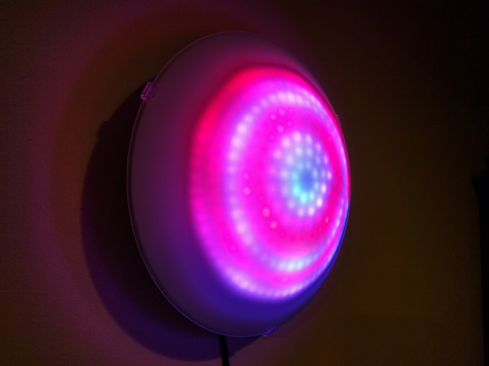

Psilocbye Lamp
=========

Control an addressable LED strip with an ESP8266 via a web browser for a Psilocbye lamp see https://www.evilgeniuslabs.org/psilocybe

Hardware
--------

Building the lamp see https://www.evilgeniuslabs.org/psilocybe it uses 241 addressable RGB leds as rings e.g. https://de.aliexpress.com/item/1005004109462341.html and a ESP device like d1 mini or similar. (https://de.aliexpress.com/item/1005003631086102.html)

To control the data line of the led rings it is recommended to use a level shifter or a driver e.g. HCT 245.

To make it nice looking the led rings should be behind a diffusor. Easiest and nice way to do this, is to reuse a regular lamp like this.

This how it looks (Jasons video): https://youtu.be/mms5l1I2q0M

 image courtesy of jason

Firmware
--------
Firmware is a fork of Jasons initial version https://github.com/evilgeniuslabs/psilocybe but extended with some convenient addons:

- mqtt control and status for intergration in e.g. home assistant
- WifiManager for easier setup of wifi network
- OTA for easier firmware updates
- speed control for almost all effects

MQTT 
------------
This is an example how the Psilocybe can be configured as a home assistant mqtt light device:
````
- name: 'Psilocybe'
  state_topic: psilocybe/psilo1/state
  state_value_template: '{{ json_value.power }}'
  payload_on: 'on'
  payload_off: 'off'
  command_topic: psilocybe/psilo1/cmd/power
  brightness_state_topic: psilocybe/psilo1/state
  brightness_value_template: '{{json_value["brightness"]}}'
  brightness_command_topic: psilocybe/psilo1/cmd/brightness
  rgb_command_topic: psilocybe/psilo1/cmd/solidcolor
  rgb_state_topic: psilocybe/psilo1/state
  rgb_value_template: "{{ json_value.solidcolor[1:3] | int(base=16) ~ ',' ~ json_value.solidcolor[3:5] | int(base=16) ~ ',' ~ json_value.solidcolor[5:7] | int(base=16) }}"
  effect_list: ['Pride', 'Color Waves']
  effect_command_topic: psilocybe/psilo1/cmd/pattern
  effect_state_topic: psilocybe/psilo1/state
  effect_value_template: '{{json_value["pattern"]}}'

````
MQTT support in not completed yet, but all basic functions work already.